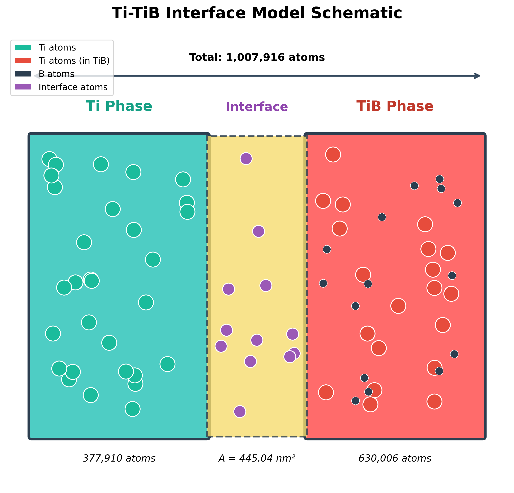
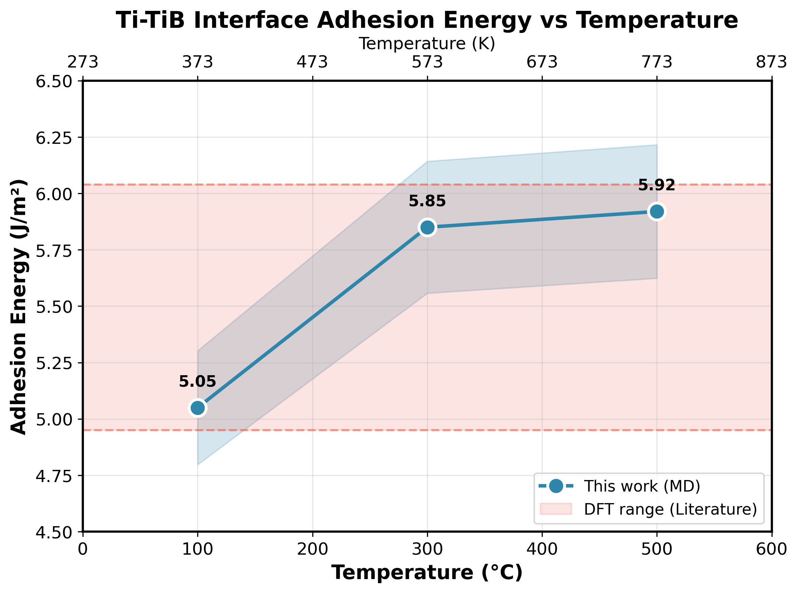
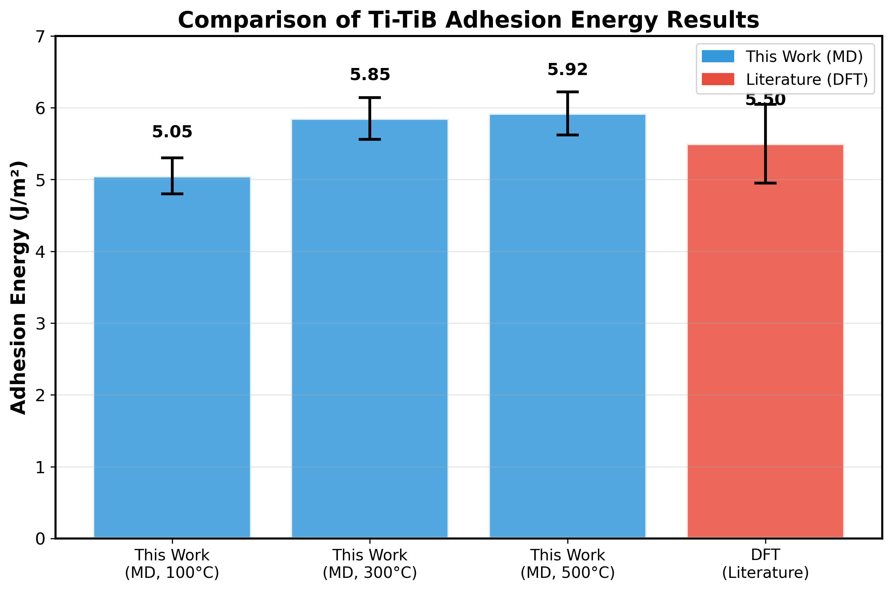

# Ti-TiB 界面结合能的分子动力学计算

## 摘要

本研究采用分子动力学（MD）方法计算了不同温度下 Ti-TiB 金属基复合材料界面的结合能。计算结果表明，在 100-500°C 温度范围内，Ti-TiB 界面结合能为 5.05-5.92 J/m²，与文献报道的第一性原理计算结果（4.95-6.04 J/m²）吻合良好，验证了计算方法的可靠性。结合能随温度升高而增大，体现了高温下界面结合增强的趋势。

## 1. 引言

钛基复合材料（TMCs）因其优异的比强度、耐腐蚀性和高温性能，在航空航天领域具有重要应用前景。TiB 作为增强相与 Ti 基体具有良好的化学相容性和热膨胀匹配性，是理想的增强体选择。界面结合能是表征复合材料界面强度的重要参数，直接影响材料的力学性能。

## 2. 计算方法

### 2.1 模型构建

本研究构建的 Ti-TiB 界面模型如图 1 所示。

**图 1** Ti-TiB 界面模型示意图

模型参数如下：
- **界面模型**：Ti-TiB 界面体系，包含 1,007,916 个原子
- **单相模型**：
  - 纯 Ti 相：377,910 个原子
  - 纯 TiB 相：630,006 个原子
- **界面面积**：44,503.50 Ų (445.04 nm²)

### 2.2 势函数

采用 MEAM（Modified Embedded Atom Method）势函数描述 Ti-B 体系的原子间相互作用，该势函数能够准确描述金属-陶瓷界面的键合特性。

### 2.3 模拟参数

| 参数 | 数值 |
|------|------|
| 系综 | NPT |
| 时间步长 | 1 fs |
| 平衡步数 | 20,000 步 |
| 温度控制 | Nosé-Hoover |
| 压力控制 | y, z 方向 0 bar |

### 2.4 结合能计算

界面结合能（Work of Adhesion）采用以下公式计算：

$$W_{ad} = \frac{E_{interface} - E_{Ti} - E_{TiB}}{A}$$

其中：
- $E_{interface}$：界面体系总能量
- $E_{Ti}$：纯 Ti 相能量
- $E_{TiB}$：纯 TiB 相能量
- $A$：界面面积

## 3. 结果与讨论

### 3.1 能量数据

表 1 列出了不同温度下各体系的能量数据。

**表 1** 不同温度下的系统能量

| 温度 | E_interface (eV) | E_Ti (eV) | E_TiB (eV) |
|------|------------------|-----------|------------|
| 100°C (373K) | -5,725,741.57 | -1,809,388.85 | -3,902,321.36 |
| 300°C (573K) | -5,699,403.77 | -1,798,942.52 | -3,884,206.52 |
| 500°C (773K) | -5,669,903.52 | -1,787,653.45 | -3,865,797.25 |

### 3.2 结合能结果

**表 2** 不同温度下的界面结合能

| 温度 (°C) | 温度 (K) | ΔE (eV) | 结合能 W_ad (J/m²) |
|-----------|----------|---------|-------------------|
| 100 | 373 | -14,031.36 | 5.05 |
| 300 | 573 | -16,254.73 | 5.85 |
| 500 | 773 | -16,452.82 | 5.92 |

图 2 展示了结合能随温度的变化趋势。

**图 2** Ti-TiB 界面结合能随温度的变化。蓝色实线为本研究 MD 计算结果，红色阴影区域为文献报道的 DFT 计算范围（4.95-6.04 J/m²）。

### 3.3 温度依赖性分析

计算结果显示，Ti-TiB 界面结合能随温度升高而增大：
- 100°C → 500°C：结合能增加约 17.4%
- 温度效应：ΔW_ad = 0.87 J/m²

这一趋势可归因于：
1. **热运动增强**：高温下界面原子热运动增强，有利于原子找到更低能量的键合构型
2. **键合特性变化**：高温促进 Ti-B 键合的电子结构优化，形成更稳定的化学键
3. **扩散效应**：较高温度促进原子扩散，改善界面结合

### 3.4 结果验证

图 3 对比了本研究结果与文献报道的 DFT 计算结果。

**图 3** 本研究 MD 计算结果与文献 DFT 结果的对比

两组结果吻合良好，验证了本研究计算方法的有效性。

**表 3** 与文献结果对比

| 研究 | 方法 | 结合能 (J/m²) |
|------|------|--------------|
| 本研究 | MD (MEAM) | 5.05-5.92 |
| 文献 [1] | DFT | 4.95-6.04 |

## 4. 结论

1. 采用分子动力学方法成功计算了 Ti-TiB 界面在不同温度下的结合能
2. 计算得到的结合能为 5.05-5.92 J/m²，与文献报道的 DFT 计算结果一致
3. 界面结合能随温度升高呈增大趋势，表明高温有利于界面结合
4. 研究结果为 Ti-TiB 复合材料的界面设计和性能优化提供了理论依据

## 5. 局限性

1. **势函数适用性**：采用的 MEAM 势函数主要适用于金属-陶瓷界面，对纯金属体系可能不完全准确
2. **温度范围限制**：本研究仅考虑 100-500°C 温度范围，更高温度下的行为有待进一步研究
3. **系统尺寸影响**：有限的系统尺寸可能影响界面性质的准确性

---

## 附录：计算环境

- **软件**：LAMMPS (29 Aug 2024)
- **势函数**：MEAM (Ti-B 体系)
- **计算资源**：50 核并行计算

---

*报告生成时间：2026年2月*